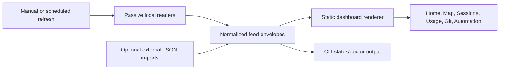

# Dashboard Coding Tracker Search Audit (2026-07-04)

- Query: <https://github.com/search?q=dashboard+coding+tracker+in%3Aname%2Cdescription%2Creadme+stars%3A%3E10&type=repositories>
- Repo focus: `/Users/gillettes/Coding Projects/mission-control`
- Audit type: source-only external search audit and pattern-mining review.
- Current Mission Control constraint: local/offline dashboard, passive readers where possible, no invented provider percentages, no broad credential/cookie surface in the dashboard itself, no full React/Vite rewrite, no cloud/default-server requirement.
- Existing local architecture inspected: `dashboard/index.html` single-file renderer, `scripts/dashboard` feed collector, `dashboard/fixtures/*.json`, `scripts/dashboard-render-smoke.js`, `PROJECT_INTENT.md`, `docs/MISSION_CONTROL_PLAN.md`, and `notes/DIRECTION-2026-07-04.md`.

## Scope And Evidence

GitHub search is broad enough that it returns many irrelevant high-star projects containing common words like `dashboard`, `coding`, or `tracker`. GitHub search also practically exposes only the top relevance window through API pagination. This audit therefore does **not** claim every matching repository was manually reviewed.

What was actually done:

- Observed GitHub Search API total: about `18.5k` repositories (`18474` in the latest run, `incomplete_results=false`; earlier same-day run observed `18475`, normal search-index drift).
- Harvested: top `1000` GitHub API results by GitHub relevance for `dashboard coding tracker in:name,description,readme stars:>10`.
- Filtered: scored candidates for Mission Control fit using repository name, description, topics, language, and high-signal terms such as token, usage, agent, session, monitor, quota, burn, cost, Codex, Claude, Cursor, Hermes, graph, workflow, and kanban; downweighted generic dashboards and unrelated infra/admin templates.
- Deep-read: README, metadata, license, screenshots/assets references, and interesting source-tree paths for high-fit repositories.
- Source capture files used during audit: `/tmp/mc-gh-search.json` and `/tmp/mc-deep-repos.json`.
- Not performed: cloning, installing, running third-party code, credentialed provider checks, paid API checks, or license-level code reuse approval.

## Headline

The strongest path is **not** to adopt a competing dashboard project wholesale and not to rewrite Mission Control into a hosted or framework app. Mission Control should keep its current static/local architecture and borrow a targeted set of product patterns:

1. compact provider/quota status cards;
2. usage attribution by provider/model/project/session/task;
3. active-session/agent monitoring;
4. GitHub-style activity heatmaps for visual scanability;
5. explicit data-source confidence and stale/unknown states;
6. mobile/menu-bar-style summaries for “needs you now”.

The search also reinforces a hard boundary: many attractive tools become risky when they auto-install hooks, read browser cookies, require API keys, expose remote dashboards, or grow into full multi-agent control platforms. Pattern-mine them first; integrate only through explicit passive-reader adapters or opt-in import commands.

## Mission Control Baseline Observed

Relevant current state in this repo:

- `dashboard/index.html` is a local single HTML file with CSS tokens, pure renderers, file://-safe feed scripts, and vendored local `cytoscape.min.js` for the connection map.
- `scripts/dashboard` writes per-feed `.json` and `.js` files under `~/.mission-control/data`, preserves last-good data on feeder failures, and marks state directories `0700`.
- The Usage tab already has provider bars, confidence chips, reset countdowns, credit rows, unused-capacity rows, and explicit no-data rows.
- The Map tab already uses Cytoscape with a side panel, repo filter, focus mode, plain edge wording, and a short recent-chat journal.
- Project intent explicitly prioritizes plain operator wording, stale-source honesty, local/offline use, and V1 clarity before usage-routing/autonomy expansion.
- Trevor’s latest product direction locks in: keep single-file/offline; use vendored local vanilla libraries only; improve the real chat connection diagram first; make usage routing practical next; do not leave Cursor blank if a safe capture path exists.

This means the best external patterns are **feed and UI refinements**, not architectural replacement.

## Candidate Findings

### High-fit usage, quota, and token trackers

| Repo | Fit | What To Borrow | What To Avoid |
|---|---:|---|---|
| [`getagentseal/codeburn`](https://github.com/getagentseal/codeburn) | Very high | Local multi-tool usage breakdowns by project, model, task/activity, core tools, shell commands, and MCP servers; compact metric cards, bar lists, usage charts, and data tables. | Do not install as a hard dependency until source paths, transcript exposure, dependency graph, and adapter contract are reviewed. Borrow shapes, not runtime. |
| [`VasiHemanth/tokentelemetry`](https://github.com/VasiHemanth/tokentelemetry) | Very high | Hermes-aware observability framing; tracks tokens, sessions, tool calls, reasoning, cron/webhook/chat surfaces; architecture-decision records and durable retention/rollup thinking. | Do not duplicate a whole telemetry backend; Mission Control should use small normalized feeds and source-confidence labels. |
| [`mm7894215/TokenTracker`](https://github.com/mm7894215/TokenTracker) | High | Local-first, zero-config framing; provider cards; total-token/cost dashboard; activity heatmap; desktop widget and menu-bar patterns; integration matrix wording for what is/ is not captured. | Avoid hook auto-install, cloud/leaderboard, and broad provider integration unless each adapter is explicitly reviewed for privacy/collision risk. |
| [`Dicklesworthstone/coding_agent_usage_tracker`](https://github.com/Dicklesworthstone/coding_agent_usage_tracker) | High | Unified CLI mental model for Codex, Claude, Gemini, Cursor, and Copilot; `doctor`, history, cost, quota, and rate-limit commands; schema-first usage snapshots. | It is a separate Rust CLI with its own storage; use it as adapter-contract inspiration, not a required dependency. |
| [`androidZzT/cc-statistics`](https://github.com/androidZzT/cc-statistics) | Medium-high | Multi-tool “efficiency” framing; quota prediction; web dashboard + CLI comparison matrix; share/export session concept. | Swift/iOS/native scope is beyond this repo; avoid mobile app creep. |
| [`stormzhang/token-tracker`](https://github.com/stormzhang/token-tracker) | High | GitHub-style activity heatmaps, daily/weekly/monthly screenshots, statusline pattern for Claude/Codex, multi-model cost comparisons. | Python 3.11 dependency and statusline hooks are optional; Mission Control can implement heatmap with vanilla CSS grid over existing feed data. |
| [`mag123c/toktrack`](https://github.com/mag123c/toktrack) | Medium-high | Fast local history scanning across Claude Code, Codex, Gemini, Qwen, OpenCode, PI Agent, and Antigravity; “huge histories stay fast” framing. | Do not replace existing collectors unless a benchmark proves real local value. |
| [`juliantanx/aiusage`](https://github.com/juliantanx/aiusage) | High | Local dashboard across Claude, Codex, Hermes, Qoder, and more; tool calls, quota pressure, project extraction, import/export commands, server separated from CLI. | Avoid bundled server/cloud paths in default Mission Control. |
| [`phuryn/claude-usage`](https://github.com/phuryn/claude-usage) | High | Stdlib-style local scan/cache model; explicit progress bars for subscribers; session history dashboard; tests around dashboard/subagent output. | Claude-only and CDN/chart dependencies are not direct-fit; vendor/rebuild any chart locally if used. |
| [`NYCU-Chung/cc-statusline`](https://github.com/NYCU-Chung/cc-statusline) | High for compact copy | One-line statusline: session info, quota bars, agent tracker, MCP health, message history. This is a strong copy/information-density source for Mission Control’s top strip. | Claude-only hook/statusline mechanics should stay separate from the offline page. |
| [`steipete/CodexBar`](https://github.com/steipete/CodexBar) | High for quick-look UX | Menu-bar popover pattern; tiny provider status cards; reset countdowns; provider incident badges; manual/1m/2m/5m/15m cadence language. | Avoid browser-cookie/keychain/full-disk-access surfaces inside Mission Control; any such tool must be opt-in and separately owned. |
| [`onllm-dev/onWatch`](https://github.com/onllm-dev/onWatch) | Medium-high | Quota cycles, burn forecasting, threshold alerts, all-provider dashboard, SQLite daemon, Material Design 3 status panels. | GPL and API-key daemon surface make it a pattern source, not a direct dependency. |

### High-fit session, agent, and workflow monitors

| Repo | Fit | What To Borrow | What To Avoid |
|---|---:|---|---|
| [`graykode/abtop`](https://github.com/graykode/abtop) | Very high | “Like htop, but for AI coding agents”: active session table with status, model, context percentage, tokens, rate limits, ports, git state, and `--once`/JSON snapshot. This maps directly to a Mission Control Sessions monitor. | Treat JSON as sensitive because local process/session context may leak. Do not make the dashboard a process-control surface by default. |
| [`kenn-io/agentsview`](https://github.com/kenn-io/agentsview) | Very high | Local-first session search, analytics, insights, token stats, master-detail dashboard, direct read fallback when daemon is cold, screenshot-level dashboard anatomy. | Do not expose public dashboards without auth; Mission Control should remain local-only by default. |
| [`simple10/agents-observe`](https://github.com/simple10/agents-observe) | Medium-high | Hook event timeline, replayable status stream, filtering/search, subagent hierarchy, SQLite + WebSocket split. | Hook-heavy Docker/server design is more moving parts than V1 needs. Use timeline/replay as inspiration only. |
| [`hoangsonww/Claude-Code-Agent-Monitor`](https://github.com/hoangsonww/Claude-Code-Agent-Monitor) | Medium | Existing source card already supports hook-to-SQLite-WebSocket and two-level graph disclosure pattern; subagent orchestration dashboard. | Claude-only and hook-bound; not the cross-provider base. |
| [`agent-of-empires/agent-of-empires`](https://github.com/agent-of-empires/agent-of-empires) | Medium-high | Multi-agent sessions across branches/worktrees, TUI + web, mobile access framing, isolated session/worktree persistence. | Remote tunnel/session manager is outside current Mission Control scope; never make Mission Control auto-merge/push active work. |
| [`RunMaestro/Maestro`](https://github.com/RunMaestro/Maestro) | Medium | “Command center” language, task/session analytics, conductor-themed progress/status framing, long-running orchestration view. | AGPL and full orchestration surface are too heavy for this local dashboard. |
| [`EKKOLearnAI/hermes-studio`](https://github.com/EKKOLearnAI/hermes-studio) | Medium-high for Hermes patterns | Hermes-specific dashboard ideas: sessions, cron jobs, usage analytics, skills/plugins/providers/config visibility, scheduled jobs. | Do not duplicate Hermes itself or turn Mission Control into a Hermes admin panel. Mission Control should show enough status to route work, then jump to Hermes when needed. |
| [`builderz-labs/mission-control`](https://github.com/builderz-labs/mission-control) | Medium | Same-name agent orchestration dashboard; spend governance, agent fleet panels, gateway health, incident stream, warning banners with action buttons, “golden signal” cards. | It is a broad self-hosted platform with many panels, RBAC, gateways, and API sprawl. Use as a warning against second-system complexity. |
| [`HamedMP/CursorLens`](https://github.com/HamedMP/CursorLens) | High for Cursor gap | Cursor usage logging and dashboarding; local/proxy logging pattern for a tool where provider usage API is unavailable. | AGPL and API/proxy model need careful review. Any Cursor capture should be opt-in and privacy-contained; screenshots/manual import may be safer first. |
| [`ActivityWatch/activitywatch`](https://github.com/ActivityWatch/activitywatch) | Medium | Local event-bucket/timeline model and privacy-forward personal analytics framing. | Broad activity tracking can become invasive. Use only if Trevor explicitly wants time/activity capture. |

### Lower-fit but pattern-useful dashboard/framework results

| Repo | Fit | Useful Pattern | Reason Not To Adopt |
|---|---:|---|---|
| [`tabler/tabler`](https://github.com/tabler/tabler) | Medium visual | Mature cards, badges, tabs, iconography, dense tables, small status components. | Existing source card already says pattern-mine only; do not install wholesale into file:// dashboard unless proven simpler. |
| [`spatie/dashboard.spatie.be`](https://github.com/spatie/dashboard.spatie.be) | Low-medium | Large glanceable operational tiles and human-readable status copy. | Laravel app architecture is not useful here. |
| [`gridstack/gridstack.js`](https://github.com/gridstack/gridstack.js) | Low now | Optional future drag/drop widget layout. | Drag/drop is not a V1 usability fix and can create messy local state. |
| Kubernetes/OpenSearch/OpenStack/Saleor/Creative Tim dashboards | Low | General dashboard anatomy only. | High-star but low-fit; they solve hosted/admin SaaS or infra dashboards, not Trevor’s local AI coding operator dashboard. |

## Cross-Repo Patterns To Implement

### 1. Provider and quota status should become a first-class decision strip

Influenced by CodexBar, TokenTracker, onWatch, CodeBurn, cc-statusline, and coding_agent_usage_tracker.

Mission Control should make the top Usage answer:

- Which provider/tool can I safely use now?
- Which one is close to reset, quota, spend, or rate limit?
- Is the number live, estimated, stale, manual, skipped, or unavailable?
- What should I do next: wait, switch model/tool, refresh, authenticate, or ignore?

Recommended normalized provider/window shape:

| Field | Reason |
|---|---|
| `provider` / `tool` | Shows Claude, Codex, Hermes, GLM/Z.AI, Cursor, Copilot separately. |
| `window` | 5h, weekly, monthly credit, daily API, plan bucket, etc. |
| `state` | `can-use`, `watch`, `wait`, `auth-needed`, `not-captured`, `stale`. |
| `used` / `limit` / `pct` | Only when source actually supports it. |
| `resets_at` / `resets_in` | Countdown pattern from CodexBar/statusline tools. |
| `pace` | “hot”, “normal”, “cold”, but only if both usage and window progression are known. |
| `source_kind` | `official`, `local-cache`, `estimated`, `manual`, `not-captured`. |
| `confidence` | Prevents estimates and stale caches from looking official. |
| `next_action` | Plain operator copy: “Use GLM for routine work”, “Wait 42m for Claude”, “Cursor not captured; import manually”. |

This extends the current Usage tab rather than replacing it. The existing confidence chip and countdown code are a good base; the missing piece is the explicit “can I use it now?” decision label.

### 2. Usage needs attribution, not just totals

Influenced by CodeBurn, TokenTracker, claude-usage, AgentsView, and toktrack.

The useful drill-down levels are:

- by provider/tool;
- by model;
- by project/repo;
- by session/chat;
- by day/window;
- by task/activity;
- by shell command / core tool / MCP server when safely derivable.

This is more useful than a giant total-token chart because Trevor’s real question is: “What should I use next, and what burned the window?”

Implementation boundary:

- Add a normalized local feed envelope first.
- Allow optional external JSON imports from tools like CodeBurn/toktrack only after the Mission Control feed contract is stable.
- Do not read provider credentials or browser cookies inside the dashboard renderer.
- Do not invent percentages for providers where only health/credit presence is known.

### 3. Add a GitHub-style activity heatmap, but keep it local and simple

Influenced by stormzhang/token-tracker, TokenTracker, AgentsView, and general developer-dashboard patterns.

This is the single highest-impact visual pattern missing from Mission Control. A heatmap can make the dashboard feel immediately easier to scan without adding a framework.

Recommended heatmaps:

- chat activity by day;
- token/usage burn by day where reliable;
- commits/landed work by day;
- unfinished handoffs created/resolved by day;
- automation failures by day.

Implementation note: this can be a CSS grid in vanilla JS over existing feed snapshots. No chart library is required for V1. Color must not be the only signal; each day cell needs a title/ARIA label with count and source.

### 4. Add a current agent/session monitor table

Influenced by abtop, AgentsView, agents-observe, and agent-of-empires.

Mission Control needs one table for active work across local coding agents:

- chat/session name;
- provider/tool;
- repo/cwd;
- state: `working`, `needs you`, `blocked`, `idle`, `stale`, `done`, `unknown`;
- branch/dirty/ahead state when known;
- model/effort when known;
- context/tokens when known;
- last activity;
- actions: reopen, read transcript, inspect diff.

This should be table-first, not chart-first. It directly supports the project’s top job: see which chats and repos need attention now.

### 5. Improve the Connection Map side panel before adding more graph complexity

Influenced by AgentsView, agents-observe, Claude-Code-Agent-Monitor, and Mission Control’s current Cytoscape implementation.

Current Map already has the right base: dots for chats, edge types, repo filter, focus mode, and side panel. Improvements should target readability:

- Show selected chat as a **summary card**: title, provider, repo, live/last activity, unfinished count, confidence/source health.
- Group connections by plain edge meaning: “started by this chat”, “audited this chat”, “mentioned this chat”, “continued from”.
- Show confidence and source labels on connections, especially lower-confidence title/scan/manual links.
- Add “Why am I seeing this?” copy for focused graph scope and cap behavior.
- Keep the graph deterministic if possible. The current `cose` randomization can make the map shift between refreshes; consider a stable layout or persisted positions later if it causes disorientation.
- Do not default to a force-directed graph for large history. Use focus mode, repo filters, clustered cards, and tables for >50 sessions.

### 6. Make data-source honesty visible everywhere

Influenced by claude-usage, AgentsView, CodexBar, onWatch, TokenTelemetry, and current Mission Control stale-ingest rules.

Every panel should expose a small provenance line:

- `live`;
- `local cache`;
- `official API`;
- `estimated`;
- `manual`;
- `partial`;
- `stale`;
- `skipped`, with reason;
- `not captured`, with reason.

The “not captured” state matters. A blank or frozen green status is worse than a visible limitation. This should be a product principle, not only a feed implementation detail.

### 7. Improve navigation around user questions, not data sources

Search-result dashboards tend to organize by implementation area. Mission Control should organize by Trevor’s questions:

- Home: what needs attention now?
- Map: how did chats/work connect?
- Sessions: what is running, stalled, or waiting for me?
- Usage: what can I safely spend next?
- Git: what changed and what needs landing?
- Automation: what is scheduled or unhealthy?
- Records: what did we decide and where is the proof?

This matches the current product intent. The search confirms that adding more panels is less valuable than making existing tabs answer these questions cleanly.

### 8. Add a compact phone/menu-bar style summary later

Influenced by CodexBar, TokenTracker widgets, cc-statusline, and agent-of-empires mobile access.

A compact “needs you now” surface should summarize:

- `Needs you`: blocked/stale sessions, failed jobs, dirty repos needing decision.
- `Can use`: providers/models with headroom.
- `Wait`: providers near reset or currently hot.
- `Running`: active agent sessions.
- `Proof`: last successful collector refresh and last dashboard update.

This can be a responsive section inside the existing file:// page before building any separate menu-bar app. Only build a native/menu-bar tool if the browser page proves insufficient.

## Backend And Data Model Implications

Mission Control should keep the current small local collector model:

Recommended normalized feed fields to support the patterns above:

| Field | Reason |
|---|---|
| `source_id` | Lets panels say where the number came from. |
| `source_kind` | Separates passive reader, official API, local cache, imported JSON, estimate, and manual note. |
| `collected_at` | Supports stale detection. |
| `confidence` | Prevents estimates from looking official. |
| `scope` | Provider, repo, session, branch, automation, or global. |
| `decision_state` | `ok`, `attention`, `blocked`, `stale`, `partial`, `not-captured`. |
| `next_action` | Turns data into user-facing workflow. |
| `raw_ref` | Path or command that produced it, not secrets or transcript payload. |
| `privacy_level` | Marks values safe for display, sensitive-local, redacted, or aggregate-only. |

Adapters should be optional and boring. Start with local files and existing scripts; add `--json` import support only after the feed contract is stable.

## Frontend And UX Implications

Strong patterns to steal:

- Compact provider cards with reset countdown and confidence label.
- Top-level “needs attention” banner only when there is a real action.
- Left-to-right priority: problem, impact, action, source age.
- Heatmaps for activity density, not critical status.
- Master-detail session browser: list on the left, selected session details on the right.
- Dense tables with stable columns for repeat decisions.
- Simple status badges with plain wording.
- Mobile-first state labels: `Needs you`, `Working`, `Blocked`, `Idle`, `Stale`, `Done`.
- Copyable actions with human labels: `Reopen this chat`, `Read it`, `Inspect diff`, `Refresh feed`, `Authenticate source`.

Patterns to reject:

- Generic drag/drop dashboards before the information hierarchy is stable.
- Force-directed graph as the default view for large history.
- Decorative card sprawl or 20+ panel home screens.
- Full remote-control surface inside Mission Control.
- Login/RBAC/API architecture unless Mission Control becomes multi-user, which is not the current product.
- Provider scoreboards that imply precision from local estimates.
- Default hooks/proxies that alter coding tools without an explicit opt-in review.

## Prioritized Mission Control Queue

### Immediate V1 clarity upgrades

1. **Per-panel source line**: show `source`, `confidence`, `last checked`, and `stale/not captured` on Home, Map, Chats/Sessions, Usage, Git, and Automation.
2. **Usage decision cards**: group provider/window rows into cards with `Can use / Watch / Wait / Not captured`, reset countdown, confidence, and next action.
3. **Map side-panel clarity**: selected-chat summary card, grouped connection list, confidence/source labels, and plain “why shown” text.
4. **Needs-you queue wording**: make every row answer problem → impact → next action → source age; keep whole-row click behavior.
5. **Compact session monitor**: add a table for active/stale/waiting sessions using existing chat/git feeds before adding new collectors.

### Near-term V1.5

6. **Local activity heatmap**: chat activity, usage burn, unfinished handoffs, and commits by day using vanilla CSS grid.
7. **Usage attribution table**: provider/model/project/session breakdown where sources support it; show `not captured` rows for Cursor/Copilot gaps.
8. **Cursor capture experiment**: pattern-mine CursorLens, but start with privacy-contained manual/screenshot/import or proxy-off-by-default design.
9. **Observation-quality badge**: panel-level badge summarizing whether data is live, estimated, stale, manual, partial, or unavailable.
10. **Mobile summary section**: responsive “Needs you / Can use / Wait / Running” section inside the current page.

### Later V2

11. **Routing recommendation**: recommend model/platform only when source confidence is high enough; otherwise say exactly what is unknown.
12. **Yield lens**: correlate tokens/sessions to merged commits, reverted changes, abandoned dirty work, audits, and no-op/help sessions.
13. **Optional external adapters**: import JSON from external trackers only through reviewed local adapter contracts.
14. **Optional menu-bar/phone companion**: build only if the responsive file:// page does not provide enough quick-glance value.
15. **Automation/autonomy loop**: use the same decision states to surface safe auto-fix opportunities, but never merge/push active work or make destructive changes without containment.

## Fit With Existing Active Work

- ER-089 usage-aware autonomous routing should start with the provider/window feed shape above and must keep unavailable sources explicit.
- ER-090 autonomous coding-hygiene loop should consume the `decision_state`/`next_action` model rather than inventing a separate urgency system.
- The Map direction in `notes/DIRECTION-2026-07-04.md` is validated: keep the real visual connection diagram, but improve its side-panel copy, source/confidence labels, and scope explanation.
- The current single-file/offline architecture is also validated: the external repos have useful patterns, but most have heavier stacks than Mission Control needs.

## Source-Capture Status

Existing relevant source cards in the broader third-party research index already cover:

- `researched-repos/tabler-tabler.md`
- `researched-repos/hoangsonww-claude-code-agent-monitor.md`
- `researched-repos/jazzyalex-agent-sessions.md`
- `researched-repos/tombelieber-claude-view.md`
- `researched-repos/ccusage-ccusage.md`

New top candidates that should receive separate source cards when the shared third-party checkout is clean:

- `getagentseal/codeburn`
- `VasiHemanth/tokentelemetry`
- `mm7894215/TokenTracker`
- `Dicklesworthstone/coding_agent_usage_tracker`
- `graykode/abtop`
- `kenn-io/agentsview`
- `steipete/CodexBar`
- `stormzhang/token-tracker`
- `juliantanx/aiusage`
- `HamedMP/CursorLens`

This audit keeps the actionable findings in the Mission Control record so the next implementation pass is not blocked on third-party index maintenance.

## Final Recommendation

Do not adopt a competing dashboard project wholesale. Build the next Mission Control improvements as small, local feed and UI upgrades:

- provider/quota decision cards with reset and confidence labels;
- usage attribution tables;
- active-agent/session monitor;
- activity heatmap;
- data-source honesty line per panel;
- improved Map side-panel source/confidence wording;
- later yield lens tied to git outcomes.

This keeps the repo aligned with its current purpose: a local operator dashboard that explains what needs attention and why, without becoming a second agent platform.
