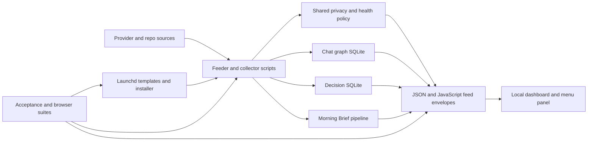
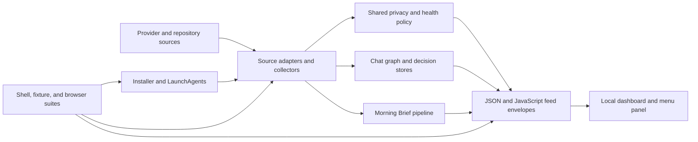

# Full-repo convergence audit

Date: 2026-07-12
Status: complete; merged, installed, live-verified, and redundant branches/worktrees cleaned
Audit branch: `codex/full-repo-audit-20260712`
Audit worktree: `/Users/gillettes/Coding Projects/mission-control-worktrees/full-repo-audit-20260712`
Merge target/base inspected: `origin/main` at `659b8d218cb57044506f949d0a3fd47de921eb42`
Source thread: Codex `019f59f8-bb9e-70c0-9497-a9686ea24154`

## Audited Chat

### Primary product/orchestration audit

- Audited chat name: `Audit: Mission Control orchestration priorities`
- Audited chat repo/cwd: `global-implementations` / `/Users/gillettes/Coding Projects/global-implementations`
- Provider: Codex
- Full ID: `019f4963-1e75-7600-8a17-1e6f6f8e8ca6`
- Transcript/resolved path: `/Users/gillettes/.codex/sessions/2026/07/09/rollout-2026-07-09T17-17-40-019f4963-1e75-7600-8a17-1e6f6f8e8ca6.jsonl`

### Final-gate orchestration audit

- Audited chat name: `Audit: Review Orchestration tools`
- Audited chat repo/cwd: `global-implementations` / `/Users/gillettes/Coding Projects/global-implementations`
- Provider: Codex
- Full ID: `019f4f6c-e506-7551-876e-d9bb31f56c36`
- Transcript/resolved path: `/Users/gillettes/.codex/sessions/2026/07/10/rollout-2026-07-10T21-26-04-019f4f6c-e506-7551-876e-d9bb31f56c36.jsonl`

### Round-eight Mission Control worker

- Audited chat name: `worker:e85411a1 - morning-brief fix round 8 (installer fail-closed)` (resolved title begins with the spawn-binding packet)
- Audited chat repo/cwd: `mission-control` / `/Users/gillettes/Coding Projects/mission-control`
- Provider: Codex
- Full ID: `019f5056-bc55-7043-88ad-b87b1ac48a6f`
- Transcript/resolved path: `/Users/gillettes/.codex/sessions/2026/07/11/rollout-2026-07-11T01-41-29-019f5056-bc55-7043-88ad-b87b1ac48a6f.jsonl`

### Live portfolio orchestrator with Mission Control work

- Audited chat name: `Build autonomous orchestration`
- Audited chat repo/cwd: `global-implementations` / `/Users/gillettes/Coding Projects/global-implementations`
- Provider: Codex
- Full ID: `019f51c1-5817-7872-a6ce-8b65428277ed`
- Transcript/resolved path: `/Users/gillettes/.codex/sessions/2026/07/11/rollout-2026-07-11T08-17-34-019f51c1-5817-7872-a6ce-8b65428277ed.jsonl`
- Audit boundary: its Mission Control commits and promises were reconciled; the still-running chat had moved to a separate `mac-health` lane, so this audit did not wait for unrelated portfolio work.

### Original product-direction review

- Audited chat name: `*Chat connection tracking tool`
- Audited chat repo/cwd: `global-implementations` / `/Users/gillettes/Coding Projects/global-implementations`
- Provider: Claude Code
- Full ID: `1ef98716-30bb-4530-80e0-6b2f3fa74f79`
- Transcript/resolved path: `/Users/gillettes/.claude/projects/-Users-gillettes-Coding-Projects-global-implementations/1ef98716-30bb-4530-80e0-6b2f3fa74f79.jsonl`

### Round-eight governing chat

- Audited chat name: `*Venting my thoughts`
- Audited chat repo/cwd: `global-implementations` / `/Users/gillettes/Coding Projects/global-implementations`
- Provider: Claude Code
- Full ID: `e85411a1-b74b-4556-9939-8eaf5d8f2ea9`
- Transcript/resolved path: `/Users/gillettes/.claude/projects/-Users-gillettes-Coding-Projects-global-implementations/e85411a1-b74b-4556-9939-8eaf5d8f2ea9.jsonl`

The exact source metadata above was resolved with `chat-source describe`; final visible claims were checked with `chat-source latest-exchange`. Titles are navigation labels only. IDs, paths, and current Git state are the source of truth.

## Session and branch reconciliation

| Source | Unique request or claim | Current disposition |
|---|---|---|
| `019f4963` | Deterministic/Tier-1 and bounded Tier-2 Morning Brief, repeated audit, no-provider install, and honest external gates | Implemented and already contained by `main`; this audit retained the explicit natural-morning and provider-calibration gates. |
| `019f4f6c` | Immutable Morning Brief final gate, notification consolidation, Outcome Extractor activation discipline, and a separately scoped automatic executor | Final-gate code is contained by `main`; consolidation decisions were recovered from the dirty ER-103 checkout; the automatic executor remains a separate portfolio/global capability, not missing code in this repo. |
| `019f5056` | Fail-closed installer, full-ingest evidence honesty, branch-history/provenance corrections, and at-least-once wording | Later `main` contains the implementation and records; current tests preserve those invariants. |
| `019f51c1` | Chat truth-layer cache/timeout/process cleanup plus desktop-first follow-through | `origin/main` contains the chat-truth repair and desktop-first PR; later activity is in `mac-health`, not an unfinished Mission Control mutation. |
| `1ef98716` | Plain-language Home/Map/Chats product direction and connected-chat journal | Implemented in the current UI and renderer tests; no unlanded repo branch remains for this feedback. |
| ER-103 Cursor lane | Git lifecycle metadata, proof harvester, notification collision analysis, and Trevor's three morning-surface decisions | Commits `7202ab2` and `0a609f8` are patch-contained in this audit branch. Valid uncommitted decision/model changes from the preserved source checkout were integrated without mutating that checkout. |

Fresh topology proof found only two branches with commits not ancestrally reachable from the candidate: `codex/er103-git-state-and-morning-proof` and `er134-morning-brief-desktop-cta-202607122313`. `git cherry` marked every one of their commits with `-`, proving patch-equivalent containment. There is no known unique uncontained implementation commit in the local or `origin/*` branch set.

## Findings and repairs

| Severity | Reproduced finding | Durable disposition |
|---|---|---|
| P1 | Decision-answer writers could split prompt, answer JSON, and decision history | Per-decision advisory lock spans the whole transaction; state is rechecked under lock; concurrent regression requires exactly one coherent winner. |
| P1 | Caller-controlled `MC_DECISION_ANSWER_LOCK_HELD=1` bypassed the first lock repair | Removed environment trust. The lock is now an inherited, inode-verified file descriptor; the regression deliberately sets the old marker on both writers. |
| P1 | A blocked answer-sidecar path failed after database resolution, leaving a prompt plus unretryable resolved decision but no answer receipt | Both filesystem artifacts are now preflighted and staged before resolution, then atomically published. Exact-choice replay recognizes a matching manual resolution and repairs a crash between database resolution and artifact publication. The regression covers both blocked-first-attempt and post-resolution recovery. |
| P1 | Symlinked `answers/` or `prompts/` parent directories redirected private transaction artifacts outside the Mission Control state root | State home plus both transaction parents are now `lstat`-validated as real directories before chmod, lock, or staging. Regressions cover both linked parents, unchanged external sentinels, no outside artifact, and an open decision after refusal. |
| P1 | An attacker or concurrent process could rename and replace a previously validated `answers/` or `prompts/` directory between validation and publication | The complete answer transaction now runs in one Python process with `O_DIRECTORY|O_NOFOLLOW` directory descriptors and the advisory-lock descriptor held throughout. Stage writes and atomic replacements are relative to pinned descriptors; inode bindings are revalidated immediately before database resolution and again before publication. The deterministic rename/swap regression covers both directories and proves open state, no redirected output, and no surviving stage files. |
| P1 | Proof harvesting replaced Trevor-owned read/understood/notes fields | Machine columns merge into existing rows while the three operator columns remain unchanged. |
| P1 | Proof rows broke on Markdown delimiters and could lose parseability | Escaped-cell parser/writer covers pipes, backslashes, and line breaks. |
| P1 | Proof harvesting copied private `latest.md` prose into a tracked record | Raw brief prose is never read or copied; only bounded receipt state, counts, timestamps, section count, and validated digest are retained. Malicious ID/state/prose fixtures are rejected or excluded. |
| P1 | Lifecycle-only scanner findings returned `findings_total: 0` and exit zero | Human and JSON modes now share the privacy-screened facts packet; lifecycle decision rows affect the final total and exit status. |
| P1 | A clean local-only `main` was falsely unexplained because no remote default existed | No-remote repos infer an existing protected `main`/`master` locally; configured remotes with unknown HEAD remain fail-closed. |
| P1 | App staging followed attacker-preseeded binary/plist/app-directory symlinks | Runtime roots and every app ancestor are link-refusing; binary/plist deployment is atomic; deployed binary hash is checked. Three external-target regressions pass. |
| P1 | Installed/runtime path and asset attestation omitted panel/composer surfaces | Canonical runtime and asset sets include the panel source, composer, panel HTML, launchd template, and vendor asset; tampering fails verification. |
| P1 | Feeder writes and decisions collection could interleave/crash or trust future timestamps | Kernel locks, healthy sidecars, and future-date recollection regressions now cover these paths. |
| P1 | Chat graph and Outcome Extractor locks could trust a reused PID | Process-start identity is recorded and compared before stale lock recovery. |
| P1 | Native Swift decision bridge blocked the main thread | The process bridge is asynchronous and covered by source/compile checks. |
| P1 | Browser/privacy fixtures drifted from shared sanitization policy | Browser fixtures use the shared privacy packet and adversarial cases. |
| P2 | Mobile tables/nav, active-tab visibility, copy feedback, strip target size, and light/dark contrast were incomplete | Source and real-browser assertions cover desktop/mobile overflow, active nav, clipboard failure truth, named controls, target tolerance, and WCAG color ratios. |
| P2 | Decision UI inferred question/options only from prose | Producer carries structured `question`, `options`, and `recommended`; UI prefers those fields and retains bounded fallback parsing. |
| P2 | Authoritative verifier omitted the proof harvester | `verify.sh` runs the self-test and compiles the script in memory. |
| P2 | The unfinished-work scanner passed its potentially large aggregate JSON document through one command-line argument | Final-count extraction now reads JSON from stdin, removing the `ARG_MAX` failure boundary. Scanner self-test passes. |
| P2 | Feed lock setup/acquisition filesystem errors were classified as ordinary lock contention, hiding a broken/unsafe lock path from operators | Lock files use `O_NOFOLLOW`, descriptor chmod, and a regular-file check. Only real nonblocking contention returns `locked`; setup/acquisition faults write sanitized error sidecars. A broken-lock-path regression requires strict failure and observable error state. |
| P2 | Audit branch itself lacked lifecycle metadata | Full Active Branch Ledger entry added with owner, purpose, exit conditions, evidence record, and cleanup command. |
| P3 | Strict browser target comparison flaked at `43.999969px` for a CSS `44px` minimum | A `0.01px` rendering tolerance preserves the 44px contract; repeated browser gate passes. |
| P3 | `NSUserNotification` is deprecated | Accepted compatibility debt with an explicit SDK/removal/live-failure/permission-redesign revisit trigger in `todo.md`; migration now would introduce a new notification-permission flow without fixing current behavior. |

## Verification ledger

Focused repaired-candidate evidence before the immutable full run:

- `scripts/harvest-morning-brief-proof --self-test` — PASS, including human-field preservation, escaped operator note, private-prose exclusion, and invalid receipt rejection.
- `scripts/scan-unfinished-work --self-test` — PASS, including clean no-remote default and lifecycle-only nonzero exit.
- `scripts/dashboard.test.sh` — `PASS=66 FAIL=0`, including 12 concurrent answer races with the forged legacy marker, blocked-sidecar no-resolution proof, successful retry, exact-choice post-resolution recovery, linked-parent refusal, live rename/replacement of both artifact roots after staging, and observable feed-lock setup failure.
- `scripts/er134-usability.test.sh` — `50 passed, 0 failed`, including three app-bundle symlink counterexamples.
- `node scripts/dashboard-browser.test.js` — `253 assertions passed` across installed/demo desktop and mobile surfaces.
- `git diff --check` and Bash syntax — PASS.

The superseded `df7ab2c`, `f67e079`, and `051bfe1` candidates each completed the authoritative matrix with `SUITES PASS=21 FAIL=0`, but independent review then found, respectively, the blocked-sidecar, linked-parent, and directory rename/swap P1s above. Those green runs are retained as suite evidence, not accepted as final verdicts.

Immutable pre-PR evidence at `b79d91d`:

- `/bin/bash scripts/verify.sh` — `SUITES PASS=21 FAIL=0`; full log `/tmp/mission-control-b79d91d-verify.log`.
- Dashboard shell/integration suite — `PASS=65 FAIL=0`.
- ER-134 decision/panel suite — `50 passed, 0 failed`.
- Installed/demo Playwright browser gate — `253 assertions passed`.
- OpenSpec strict validation, Python syntax, shell syntax, scanner self-test, privacy, graph, delivery, deadman, extractor, usage, and all remaining authoritative suites — PASS.
- Independent UX/test challenger `/root/worker_019f59f8_tests_ux` reviewed the exact immutable source after four finding/repair cycles and returned `REVIEW-CLEAN` on `b79d91d`.

GitHub review then examined all 32 changed files. Two actionable P2 comments were accepted and fixed in `86cfff8`: unbounded scanner JSON through argv, and feed-lock filesystem errors hidden as contention. Its directory-`fsync` portability suggestion was not accepted because this is a macOS-targeted local product and both complete macOS verification runs exercised those calls successfully; directory durability remains intentional. `/bin/bash scripts/verify.sh` then passed `SUITES PASS=21 FAIL=0` again on exact `86cfff8`, with dashboard `PASS=66 FAIL=0`, ER-134 `50/0`, and browser `253`.

The independent UX/test challenger then re-reviewed exact `86cfff8`, including both GitHub-review repairs and their interaction with the prior transaction fixes, and returned `REVIEW-CLEAN`.

## Merge, installation, and live closeout

- PR: [#9](https://github.com/trevor-commits/mission-control/pull/9), merged 2026-07-13 08:40 UTC.
- Reviewed head: `60c9ece16ab1360c311f811424cd33f792f949e9`; GitHub Copilot reviewed all 32 changed files, CodeRabbit approved/passed, and GitGuardian passed.
- Merge commit: `c44e5c967d0232df29ab46a7cfa07ba34d6d33a1` on `origin/main`; `git merge-base --is-ancestor` proved the reviewed head is contained.
- Canonical clean `main` worktree fast-forwarded to the merge commit; installer copied seven runtimes and four assets, and `verify_install_stamp` returned `ok:true`, no missing/mismatched/unexpected paths, provenance `head`, exact head `c44e5c9`.
- Menu-bar panel compiled/staged from the attested source, its login job is loaded and running, and the main Mission Control launchd job has last exit `0`.
- A forced live collection returned `0`; Automation, Usage, Git, Chats, and Decisions were freshly generated. Overall status remained honestly nonzero because the separate global Nightly Review job is red and the July 12 daily brief is past its midnight validity horizon before the next 07:00 run. Neither is a failure of the reviewed repo implementation.
- Outcome Extractor remains unloaded. Its pending-calibration plist remains at `/Users/gillettes/Library/LaunchAgents/com.gillettes.outcome-extractor.plist.pending-calibration-20260713`; no provider calibration or live model egress was performed.
- Removed the audit worktree, its detached baseline worktree, five redundant ER-134 worktrees, their local branches, the redundant panel/CTA local branches, and seven patch-contained remote branches. The removal push reran `SUITES PASS=21 FAIL=0`.
- Preserved `/Users/gillettes/Coding Projects/mission-control` on `codex/er103-git-state-and-morning-proof` because it contains Trevor-owned dirty files. Direct comparison proved those four files are older/superseded variants of merged main rather than uncontained implementation; preservation is intentional, not unfinished audit work.

## Honest residual gates

These are not unimplemented repo defects and must not be papered over with synthetic evidence:

1. The proof log contains three natural delivered mornings (July 10–12), not five, and Trevor's read/understood fields remain blank until he supplies them.
2. Outcome Extractor needs a separately authorized privacy-screened live provider calibration before activation. Offline code/tests are complete. The prematurely registered zero-run label was unloaded and its byte-identical plist moved to `/Users/gillettes/Library/LaunchAgents/com.gillettes.outcome-extractor.plist.pending-calibration-20260713` (SHA-256 `e5e561f72e86bbc2cfcb0c00c10deab60ff5522d31d56e6fbd6a04337eb294d9`); the canonical plist is absent and the label is not loaded. Rollback after an approved calibration: move it back to `com.gillettes.outcome-extractor.plist`, validate with `plutil`, then bootstrap the label.
3. Provider delivery is intentionally at-least-once. Provider acceptance followed by a local crash before receipt persistence remains an explicit ambiguity; the queued reconciliation state machine is not falsely claimed here.
4. The portfolio automatic work executor is a separately scoped global capability with broader authority and safety design. It is not silently pulled into this repo audit.

## Self-audit and Ripple Check

- Method: compared live `origin/main`, every local/origin branch tip, patch containment, the preserved dirty ER-103 checkout, exact resolved session metadata/latest exchanges, durable Work/Audit/Test logs, runtime code, installed-state contracts, and independent counterexample reports.
- Outcome: every reproduced code, privacy, UI, test, and repo-governance defect has an implementation or explicit accepted-debt disposition plus a focused regression. The final implementation passed the complete matrix repeatedly, independent and GitHub reviewers converged clean, the reviewed head is contained by `origin/main`, the installed tree is stamp-verified, and live collection/panel execution work as designed.
- Did not verify yet: five elapsed mornings, Trevor comprehension, or provider calibration, because those require time or explicit external authorization; no live provider send was performed.
- Ripple Check: reviewed `PROJECT_INTENT.md`, `AGENTS.project.md`, `CONTINUITY.md`, `COHERENCE.md`, `LINEAR.md`, root `todo.md`, current OpenSpec state, dashboard feed consumers, install/stamp sets, and the morning-surface collision record. The product remains local/offline, repo-only for Linear, and external-provider gated.
- Better-path challenge: fixed truth and deployment boundaries at their producers and authoritative verifier rather than adding another parallel audit harness or weakening fail-closed gates.

by: Codex thread `019f59f8-bb9e-70c0-9497-a9686ea24154`, with independent architecture/security and UX/test challengers.
linear: self-contained under the repo-only contract in `LINEAR.md`.

---

## 2026-07-13 fresh convergence re-audit

This addendum re-proves the earlier closeout from current `origin/main`; it does
not treat the prior green report as evidence for this run.

### Fresh audit fingerprint and scope

- Candidate/base: clean `main` at `a7e4edab8305d122c312cbeaac10c83f55adb7a7`, equal to `origin/main` after `git fetch --prune origin`.
- Preserved concurrent checkout: `/Users/gillettes/Coding Projects/mission-control` on `codex/er103-git-state-and-morning-proof`, with its four pre-existing modified files untouched.
- Runtime: Node `v26.3.1`, pnpm `10.22.0`, Python `3.14.6`; authoritative shell gates use macOS `/bin/bash`.
- Inventory: 124 tracked files; local and remote topology again contained only `main` plus the intentionally preserved ER-103 branch.
- Audit surfaces: implementation, runtime/install state, privacy/security boundaries, test authority, architecture, governance/ripple records, and provider-native Codex/Claude session feedback.

### Architecture map and Brooks audit

The local/offline, feeder-to-envelope architecture remains the right shape for a
single-operator product. It minimizes network and deployment surface, gives each
source a bounded adapter, centralizes privacy/health decisions, and preserves
separate state stores where transactional behavior differs. The team and software
structure align: one operator-facing product with one integration boundary and
small source-specific adapters. A service split or framework rewrite would add
coordination cost without solving an observed defect.

| Dimension | Result | Evidence |
|---|---:|---|
| Boundaries and cohesion | 20/20 | Collector, shared-policy, state, presentation, and install boundaries are explicit and independently tested. |
| Correctness and testability | 25/25 | Hermetic source seams, negative controls, transaction races, browser execution, and full verifier all pass. |
| Privacy and security | 20/20 | Field-aware egress, secret/PII regressions, fixed-argv transports, link refusal, pinned descriptors, and synthetic fixtures. |
| Operability | 15/20 | Install stamp/panel/launchd proof is live; elapsed-morning and provider-authorization gates remain honestly open. |
| Documentation and governance | 15/15 | Intent, OpenSpec, Continuity, Coherence, Linear-Core, todo, and the expanded audit/session record agree after challenger-led claim narrowing. |
| **Architecture health** | **95/100** | The five withheld points are external/elapsed product proof, not a code or architecture defect; no critical architecture issue remains. |

### Session-feedback reconciliation

The audit started with `chat-source`, then used bounded provider-native store
enumeration when an unbounded rich list stalled. Exact resolved IDs and transcript
paths remain the source of truth; titles below are only navigation labels.

| Session or group | Feedback/claim reconciled | Current disposition |
|---|---|---|
| Codex `019f2865-0cc2-7db1-82af-73646d440d6a` — original ER-087 independent reviewer; cwd `/Users/gillettes/Coding Projects/gi-worktrees/er087-mission-control`; transcript `/Users/gillettes/.codex/sessions/2026/07/03/rollout-2026-07-03T07-32-18-019f2865-0cc2-7db1-82af-73646d440d6a.jsonl` | Suppression source-key bypass, stable launchd copy, false-red pseudo job, future-schema guard, and the missing committed feeder-shape specimens. | First four were already implemented. The feeder-shape requirement was the one confirmed gap and is fixed by this addendum with a real dashboard-wrapper regression and real chat-graph collector regressions. |
| Codex `019f2d4e`, `019f2dec` | Tabler/dashboard tracker pattern recommendations. | Implemented through the July 4 cards/tables/badges/search pass and its browser tests. |
| Codex `019f2dd8` | cc-switch pattern: provider/config health. | Explicitly not adopted as a write-mode proxy/config layer; safe usage visibility remains tracked as ER-089 and requires truthful sources/auth. The old local source is no longer resolvable by `chat-source`, so no stronger provenance claim is made. |
| Codex `019f2ddb`, `019f32ea` | Cursor defect audit; enterprise stack review. | Defects landed with regressions; enterprise replacement rejected and recorded as disproportionate for this local product. |
| Codex `019f42ec`, `019f42f1`, `019f494c`, `019f495a` | Independent audit wording/severity plus Morning Brief plan privacy, concurrency, cursor, launchd, deadman, and Bash requirements. | Implemented and preserved by current tests; later exact candidates were review-clean. |
| Codex `019f4f3d`, `019f4f5f`, `019f4fd4`, `019f5010`, `019f5056`, `019f5173` | Job history, renderer safety, same-day validity, full-ingest SLA, installer provenance, and live freshness findings. | Implemented with dedicated regressions; current full matrix covers every boundary. |
| Codex `019f5447` | Remaining-work status and proof gates. | External gates remain active in `todo.md`; no repo defect was reclassified as complete. |
| Claude reviewer/worker chain `287a0123`, `421dfd00`, `4f6e94ff`, `5c6e42c0`, `610b058d`, `a6a7c236`, `adc5fd6c`, `afd58877`, `dadd8ddc`, `dd5355ae`, `fca3480e`, plus worktree sessions `de18ae00`, `d28ca029` | Independent implementation, records, UI, install, and Morning Brief challenge passes. | Their material findings are represented in the original findings ledger and regression matrix; provider-native enumeration found no additional unimplemented request. Trivial probes were excluded from the material inventory. |

### Newly reproduced finding and repair

| Severity | Symptom | Source | Consequence | Remedy and proof |
|---|---|---|---|---|
| P2 | The locked plan promised durable feeder specimens, but `dashboard/fixtures/feeders/` did not exist and tests built all upstream shapes inline. | Original ER-087 reviewer `019f2865`; `docs/MISSION_CONTROL_PLAN.md` feeder-drift guard. | A coordinated upstream output/provider-record drift could make inline mocks remain green while consumers silently lose evidence. | Added privacy-safe synthetic specimens derived from observed shapes. `chat-graph.test.sh` runs delegation, mailbox, title, transcript, topic, and outcome collectors against them; `dashboard.test.sh` runs its real command-output wrapper against authentic usage/Git output shapes and validates the stored watcher shape. Focused post-fix results: graph ALL PASS; dashboard `67/0`. |
| P2 | First repair commit `192d243` used a simplified top-level Codex message and said both suites ran “real collectors,” although the dashboard case correctly consumed stored command outputs through the wrapper rather than executing the upstream generators. | Independent challenger `/root/worker_019f59f8_tests_ux`. | The payload parser could regress while the simplified specimen stayed green, and the durable record overstated the tested boundary. | Replaced the Codex line with the real `response_item` → `payload.message` → `content[output_text]` structure, replaced usage/watcher specimens with authentic synthetic field layouts, and narrowed every plan/todo/audit/README claim to the exact consumer boundary. |

No other P0-P3 implementation defect was reproduced. ShellCheck reported no
error-severity finding; lower-severity warnings are intentional test-shell idioms
or pre-existing unused test locals and do not change runtime behavior.

### Fresh verification and live-state truth

- Pre-edit authoritative `/bin/bash scripts/verify.sh`: `SUITES PASS=21 FAIL=0`; dashboard `66/0`, ER-134 `50/0`, browser `253`.
- Post-repair focused graph suite: ALL PASS, including committed provider records through real graph collectors.
- Post-repair focused dashboard suite: `PASS=67 FAIL=0`, including committed feeder outputs through the real dashboard wrapper.
- Fixture parse, `git diff --check`, shell syntax, Python syntax, and ShellCheck error-severity: PASS.
- Forced installed collection succeeded. Install verification returned exact head `a7e4eda`, `ok:true`, and no missing, mismatched, or unexpected member. The menu panel was running; the interval job had last exit `0`.
- Overall live status remained honestly non-green because a separate global Automation job was red and the prior daily Brief was expired before the next 07:00 run. This is operational input truth, not a repo test failure.
- Outcome Extractor remains unloaded at the explicit pending-calibration plist. No provider call, send, credential action, or fabricated morning was performed.

### Honest residual gates

The prior four residual gates are unchanged: five natural mornings with Trevor
comprehension (only three receipts existed at the 02:00 audit), separately
authorized provider calibration/activation, at-least-once provider ambiguity, and
the separately scoped portfolio executor. These remain active work or external
proof—not hidden audit failures and not permission requests for already-scoped
repo work.

### Independent convergence result

The UX/test challenger audited immutable `192d243` and rejected it with the P2
consumer-boundary finding recorded above. It then audited immutable `4d21023`,
accepted the functional repair, and rejected one remaining P3 phrase that still
blurred the dashboard wrapper with graph collectors. Commit `59814aa` corrected
that exact sentence. The same independent reviewer checked the full
`a7e4eda..59814aa` change and returned `REVIEW-CLEAN` with no remaining P0-P3
finding.

The complete verifier passed `SUITES PASS=21 FAIL=0` on exact functional commit
`4d21023` (dashboard `67/0`, ER-134 `50/0`, browser `253`); `59814aa` changed only
the challenged audit sentence and passed `git diff --check`. This records an
evidence-backed reject → repair → re-audit → clean loop, not self-approval.

---

## 2026-07-13 recurring health and operations audit

This pass started from clean `main`/`origin/main` at `bcee9147b9bd45fa05e848d0ae47a3d3f876e939` and re-ran the audit from current source and live state. The preserved dirty checkout at `/Users/gillettes/Coding Projects/mission-control` remained untouched.

### Brooks-Lint Health Dashboard

**Scope:** full Mission Control repository after the repair below

**Composite Score:** 100/100

**Trend:** 96 → 100 (+4) after independent rejection and repair

| Dimension | Score | Top Finding |
|---|---:|---|
| Code Quality | 100/100 | Clean after the pinned/offline dependency repair. |
| Architecture | 100/100 | Source adapters flow through shared policy/state boundaries into local presentation; no cycle or upward dependency was found. |
| Tech Debt | 100/100 | The only reproduced dependency-drift suggestion was repaired in this pass. |
| Test Quality | 100/100 | Unit/integration, shell acceptance, committed feeder specimens, and real-browser gates remain behavior-focused and green. |

The earlier 95/100 architecture-and-operability score measures product proof, including elapsed mornings and authorization. The Brooks score measures current code, architecture, debt, and tests. They are intentionally different measurements rather than conflicting verdicts.

The initial candidate was 96/100, with three warnings and one suggestion. The
100/100 row is the repaired current tree; it is not a retroactive claim that the
rejected candidate was clean.

### Reproduced dependency-drift finding and repair

**Dependency Disorder — unbounded scheduled `ccusage` version**

Symptom: `scripts/usage-snapshot` ran `npx -y ccusage@latest` twice whenever the optional Claude usage source was enabled. The existing `ccusage/ccusage` source card explicitly allowed scheduled wrapping only after an exact version and native binary were verified.

Source: *Software Engineering at Google* — Dependency Management and upgrade blockage.

Consequence: a registry release could change scheduled output, native code, or failure behavior without any Mission Control commit, invalidating reproducibility and bypassing repository review.

Remedy: pinned `ccusage@20.0.17`, added `--offline` to both report commands, inspected the npm metadata and tarball integrity (`sha512-MJU4qDs6DOMdam0PXWWFgo0dw/kXAK05rX586DdxIARTzj/zJylWfVlIywgJwW094nNbqwJyGRZvzO2ZsczXDg==`), exercised the native macOS CLI, and added a fake-`npx` regression that proves the exact argument count and each individual argument while rejecting `@latest`. Red evidence for the initial pin was `PASS=2 FAIL=1`; the expanded focused suite is `PASS=6 FAIL=0`.

### Independent rejection and end-to-end repair

Fresh reviewer `/root/worker_019f59f8_final_challenger` rejected immutable
`105889e` rather than accepting its green suite:

| Severity | Reproduced finding | Accepted repair |
|---|---|---|
| P1 | The loaded scheduled runtime and canonical global source still used `ccusage@latest`, so the Mission-only pin did not make the operational path reproducible. | Updated the canonical global collector and LaunchAgent template, retained the same pinned package in Mission Control, and made exact source/runtime hashes a landing gate. |
| P1 | Mission Control's vendored collector treated `primary` as five-hour and `secondary` as weekly even though they are transport slots; reversed and omitted windows could be mislabeled. | Converged Mission and global parsers byte-for-byte, mapped only by `window_minutes` 300/10080, and added reversed-slot and omitted-window regressions. |
| P2 | An `npx` exit 42 still returned snapshot exit 0 and emitted Claude rows as healthy/idle. | Propagated collector failure through a nonzero snapshot exit while preserving partial JSON/history, emitted `health=down`/`confidence=unknown`, and added a deterministic failure regression. |
| P3 | The fake `npx` test flattened arguments through `$*`, so it did not prove argv boundaries. | Captured `argc` and every `arg=` independently and compared them to an exact fixture. |
| P2 | Numeric-but-impossible percentages and reset epochs passed the first validation; an extreme epoch made `todate` fail twice, erased both Codex rows, and still exited 0. | Require percentages in 0–100 and integral reset epochs in the supported range, distinguish malformed windows from honest omission, emit explicit unknown/down rows, exit nonzero, and test `-50`, `101`, and `1e300`. |
| P2 | Both scheduled `npx` commands were unbounded, so a wedged cache/registry child could hold the recurring job indefinitely. | Added a dependency-free Python process-session timeout with TERM/KILL cleanup, a 120-second production bound per command, and a hanging fake-`npx` regression that proves bounded failure and no surviving process. |
| P2 | The global LaunchAgent template still used `/bin/bash -lc` while the record claimed direct argv; removing the login shell without resolving `npx` would also fail under launchd's restricted PATH. | Replaced the command string with direct `/bin/bash`, script, `--history`, and `--html` arguments; added an explicit rendered `NPX_BIN`; and test the exact plist argument/environment contract. |
| P3 | Mission's test cases invoked unqualified Homebrew Bash even though production uses system Bash 3.2, and the global runbook retained a stale 17-test count. | Pin the test shebang and every inner invocation to `/bin/bash`; make the runbook require exit 0/no failures instead of a brittle count. |
| P3 | The global full verifier recreated `scripts/lib/__pycache__` after its bytecode-clean check. | Replaced `py_compile` with an in-memory `compile()` syntax gate and proved it leaves the source tree bytecode-clean. |
| P1 | Direct launchd argv no longer inherited login-shell PATH, so real `claude-glm`, Hermes, Node/npx, and Homebrew dependencies could be reported absent or fail even though installed. | Render absolute GLM/Hermes executables, provide a narrow explicit non-login PATH for reviewed utilities, and execute the rendered plist contract under `env -i` in the global regression. |
| P1 | Even exact-version npx could contact npm on a cold cache; one warm-cache run could not prove the scheduled no-egress invariant. | Scheduled collection now requires a copied hash-verified native ccusage 20.0.17 binary through `CCUSAGE_BIN`; npx remains only an explicit manual fallback. |
| P2 | String/missing/non-object `window_minutes` metadata was mistaken for honest omission and stayed process-green. | Validate both transport slots before duration mapping; structurally malformed metadata emits two unknown/down Codex rows and exits nonzero. |
| P2 | Active/weekly ccusage arrays with malformed nested fields leaked jq errors and could still produce estimated/healthy partial rows. | Normalize each selected record through a complete bounded schema and checked timestamp parse; invalid nested records emit explicit unknown/down rows with no jq leakage. |
| P2 | GLM doctor and credit notification calls remained unbounded after npx was bounded. | Route both through the same process-session timeout/descendant cleanup helper with separate bounds; timeout is nonzero/down and failed notifications release their retry stamp. |
| P2 | State-directory, history, waste, and dashboard write failures could return success; every lock mkdir failure was mislabeled as live contention. | Make state/output failures nonzero, render dashboard through a same-directory temporary plus rename, and distinguish live lock ownership from unsafe/I/O failures. |
| P2 | A crash could leave the bare history lock forever because it held no owner identity and never self-healed; the first owner-fenced replacement could itself strand `.recovery`, contention exposed a split-recovery race, and a future-dated ownerless directory could never age into repair. | Replace the custom directory state machine with a kernel-backed BSD `lockf` held on an inherited file descriptor. A killed process releases it automatically. Safely migrate structurally valid legacy directories when aged or materially future-dated, including crashed `.recovery` residue, and prove 16-way contention permits one writer. |
| P2 | Malformed credits JSON/schema disappeared silently through process substitution. | Validate the complete credits document before iteration, validate expiry dates, emit an explicit down configuration row, and exit nonzero on invalid configured data. |
| P1 | The newest Codex event could omit a transport slot or make `rate_limits` non-object; extraction skipped it and reused an older live value. | Select the newest event by the presence of the `rate_limits` key first, then fail down/nonzero unless the value is an object with both transport keys; add missing-primary, missing-secondary, and non-object regressions. |
| P1 | A truncated final JSONL record let `jq` emit an older valid event before failing; the trailing pipeline command hid the parse error and returned stale usage as live. | Parse the bounded JSONL sample and select its last rate event inside one checked `jq --slurp` process; any malformed record emits two unknown/down Codex rows and a nonzero snapshot. |
| P1 | Router aggregation selected only the highest numeric usage row, so a healthy weekly row could hide a down/null five-hour sibling; naïvely aggregating all provider rows would instead let held credit inventory falsely disqualify Codex. | Validate then separate routing windows from `credit:` inventory, aggregate every actual quota/health row, disqualify on any unhealthy/exhausted sibling, and add an uncertainty penalty for null/unknown siblings. |
| P2 | Router input validation checked only that `providers` was an array; negative, out-of-range, or wrong-type fields could receive favorable scores. | Validate every base row field, health/confidence enums, 0–100 percentages, and bounded reset minutes before scoring; invalid snapshots exit 65. |
| P2 | Already-passed reset windows received the spend-before-reset bonus. | Restrict the bonus to `0 <= resets_in_min <= 180` and cover negative, zero, and positive boundaries. |
| P1 | The exec table returned prohibited `gpt-5.4-mini` and silently exposed Spark without the required cheap-override justification. | Keep live routing as a provider-capacity choice, return GPT-5.5 for default Codex execution, and leave Spark only to the policy's explicit recorded override path. |
| P2 | A materially future rollout file mtime produced a negative age and could be labeled live. | Reject invalid or more-than-five-minute-future mtimes with two explicit unknown/down Codex rows and a nonzero snapshot. |
| P2 | Explicitly configured but missing GLM/Hermes executables were treated as optional absence and returned success. | Distinguish default discovery from an explicit path contract; a missing configured executable is down and makes the snapshot nonzero. |
| P1 | Scheduled GLM health invoked `claude-glm --doctor`, whose live model probe violates the recurring job's zero-LLM contract. | Default to local executable-presence health only; require explicit `--live-probes` for provider-backed doctor execution, retain bounded cleanup, and assert the rendered LaunchAgent never invokes the GLM stub. |

The repairs deliberately preserve `--no-ccusage` behavior for the dashboard,
avoid provider egress, and retain the legacy notification test seam while the
LaunchAgent uses one executable plus fixed arguments without a shell.

### Live operations and session reconciliation

- Mission Control's own implementation and interval collector remain green; install provenance was exact at the starting SHA.
- The Automation feed is correctly non-green because the separate global Nightly Review last exited `75` under the resource governor (`swap-used-above-ceiling`) and Delegation Audit has historical exit `127` from a removed pinned worktree. These are truthful upstream failures, not renderer defects. They are now explicit cross-repo follow-ups in `todo.md`.
- Outcome Extractor remains unloaded at `/Users/gillettes/Library/LaunchAgents/com.gillettes.outcome-extractor.plist.pending-calibration-20260713`. No provider calibration or send was attempted.
- Three natural Morning Brief deliveries (July 10–12) exist. The July 13 natural run had not occurred at the 02:44 local snapshot; Trevor's comprehension fields remain blank.
- The documented global session lookup route is itself regressed: `chat-source find` emits `line 77: turns: command not found` and `unknown command: find`. Provider-native fallback enumeration found no new material Mission Control feedback after the final reviewer clean result. The global checkout is dirty and behind concurrent work, so this repo audit recorded the exact external defect instead of editing that shared lane.
- A one-time 07:25 local follow-up heartbeat was proposed through the native Codex automation surface with a 07:20–08:10 stale-wake guard. It remains pending Trevor's acceptance and is not claimed as scheduled.

### Verification and convergence

- Pre-repair authoritative verifier on exact `bcee914`: `SUITES PASS=21 FAIL=0`; dashboard `67/0`, ER-134 `50/0`, browser `253`.
- Initial pin-only focused usage suite: `PASS=3 FAIL=0`; the independent challenger then rejected the incomplete operational boundary above.
- Current expanded focused usage suite: `PASS=23 FAIL=0` under `/bin/bash`; global usage-routing suite: `60 pass, 0 fail`; Mission/global collector source comparison, sanitized non-login scheduler execution, native ccusage argv, bounded-process cleanup, crash-safe kernel locking plus aged/future legacy migration, strict newest-event parse failure, conservative multi-window routing, row-schema validation, policy-compliant model selection, future-reset scoring, explicit-provider failure, zero-LLM scheduled execution, direct-argv plist contract, state-output failure, shell syntax, plist validation, bytecode-clean syntax gate, and `git diff --check`: PASS.
- Second-replacement authoritative Mission verifier: `SUITES PASS=21 FAIL=0`; dashboard `67/0`, ER-134 `50/0`, usage `8/0`, browser `253`; full log `/tmp/mission-control-usage-convergence-v2-verify.log`.
- Second-replacement authoritative global verifier: PASS with usage-routing `41/0` and no residual bytecode; full log `/tmp/global-usage-convergence-v2-verify.log`.
- Pinned/offline live-shape check: both real `blocks` and `weekly` JSON commands completed and exposed their expected top-level arrays without printing local usage data.
- Final independent challenger verdict: pending against the next immutable replacement commits and installed-runtime proof; `105889e`, `eafa38b`/`a2d7091`, and `2f56bbe`/`f900d3b` are explicitly rejected and are not final evidence commits.

The repository goal remains active until the external/elapsed proof gates are either satisfied or explicitly dispositioned; a clean code audit does not manufacture those outcomes.
